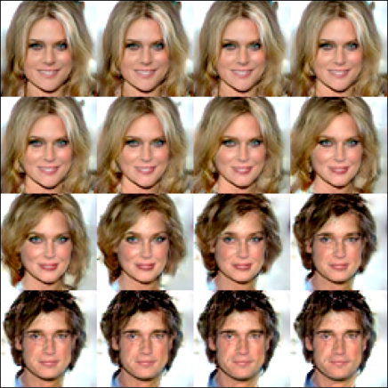

# Growing GANs for Face Generation

An adaptation of a paper by [Tero Karras et al.](https://arxiv.org/abs/1710.10196), [source repository](https://github.com/tkarras/progressive_growing_of_gans).

## Dataset

### Loading the dataset

The paper suggests a new CelebA-HQ dataset, a high-quality version of the original CelebA dataset. It contains `30,000` images of size `1024x1024`. The images are all aligned. The images are then downsampled to `256x256`, `128x128`, `64x64`, `32x32`, `16x16`, `8x8`, and `4x4`. The images are then saved in TFRecords format.

The first step to getting the dataset is downloading the original CelebA dataset and the deltas for the high-quality version. The deltas are then applied to the original dataset for a high-quality version. The whole dataset generation process is available at [their repository](https://github.com/tkarras/progressive_growing_of_gans#preparing-datasets-for-training).

I have made a few changes from their original tool, as it required a different version of libraries I could not install and thus was causing assertion errors. I have not noticed any issues with the dataset itself. My approach is based on the findings of [mazzzystar/make-CelebA-HQ](https://github.com/mazzzystar/make-CelebA-HQ), which concluded that other versions of libraries work just fine.

### Loading the dataset

Once generated, the dataset is saved in multiple TFRecords files. Loading the dataset was already provided by the original paper's authors, and with minor adjustments, I adapted it to `pytorch`. The file format does not allow for random access, so the whole dataset is loaded into memory at the start.

### Preprocessing

The dataset is already in a clean format, so the only preprocessing step is to normalize the images to `[-1, 1]` range. This is done by dividing the images by `127.5` and subtracting `1`.

## Models

Both models are a direct adaptation of the original paper, with a few adjustments for simplification.

The first change is using smaller latent space. I have experimented with sizes `256` and `512` and found `512` to produce slightly better results. The original paper uses `1024`, but since I was not planning to train the whole model, I have decided to use a smaller latent space. My goal was to train the models for size `128x128` images.

The latent vector used as an input is a random vector on a multi-dimensional unit hypersphere.

### Growing

The paper suggests an exciting approach to training a stable model - growing the model from `4x4` to `1024x1024` in steps. The model is trained on a small resolution, doubling the resolution. When a new resolution is introduced, it makes use of easing in the new layers and slowly fading out the old ones. This allows for stable training and should produce better results.

The models are built in blocks, each corresponding to a resolution. The blocks are then connected, and the model is trained on the lowest resolution. The resolution doubles when the model is ready and the new layers are eased in. The old layers are then slowly faded out, and the model continues training. This process is repeated until the model reaches the highest resolution.

Each block has its own layers to either transform from `RGB` or to `RGB`. They have to be trained separately, as the blocks have different sizes. This model is nicely visualized in the original paper in Figure 2. These layers are just `1x1` convolutions.

### Generator

A change I have made to the generator is to use `PixelNorm2d` after the first convolutional transpose layer. The paper only suggests using normalization layers after the other convolutional layers. However, I have already trained my model, so I wanted to keep it.

This is an interesting normalization, as it normalizes each pixel according to other feature maps at the same position. It also forces the model to produce results much closer to `[-1, 1]` range, which is an excellent property to have, making producing `RGB` values easier.

The generator is built of multiple blocks, each corresponding to a resolution. All (except for the first one) consist of upsampling layer, followed by two convolutional layers. The convolutional layers are followed by leaky ReLU activation function and the `PixelNorm2d` layer.

### Discriminator

The discriminator is an identical but inverted model as the generator. However, it does not utilize the `PixelNorm2d` layer. Instead, it is supposed to implement the standard deviation in the last block. However, I have decided to omit it, as it made the model unstable, producing identical results for all images, regardless of the latent input vector.

The discriminator is also built of multiple blocks. Nevertheless, no pixel normalization is used, and average pooling is used instead of upsampling. The last block is a fully connected layer, which outputs a single value.

### Dynamic weights

The paper suggests using dynamic weights and simple weight initialization for the layers. This is supposed to improve the model, but I could not implement it properly, so I used the standard approach and weight initialization instead.

### Loss

The paper suggests losses for both models, but I could not achieve stable training using them. So I instead used mean loss.

## Training

At first sizes, both models compete nicely, producing satisfactory results. However, as the resolution increases, the discriminator dominates the generator. This starts at around `32x32` resolution and worsens as the resolution increases. At this point, the discriminator can easily determine the difference between real and fake faces, and as the training goes on, the difference gets larger. It gets so bad that the generator at `128x128` resolution produces awful results, and thus I have decided to use the model trained at `64x64` resolution instead.

I tried to mitigate the problem by slowing the discriminator down by lowering the learning rate, but this made the generator overfit it. I have also tried making the minibatch size for the generator twice as large to match the number of images the discriminator sees, but this did not make a significant difference, if any. I have also tried to use the losses suggested by the paper, but this made the model unstable, and the results were worse than using mean loss. I have also tried to simplify the suggested losses but have yet to be successful.

The models train for 15 epochs while the new layer is being eased in. After that, it trains on another 25 epochs to stabilize the result. This is a similar approach to the suggested one. The only change is that I have made the training shorter, as the model used a smaller latent space.

## Results

The model produces decent results, but it could be better. The results can be unstable at times. They can be seen in [visualization](./visualization.ipynb) notebook.

It is straightforward and can produce different results by re-running the generating cell.

### Latent space interpolation

The model can be used to interpolate between two latent vectors. This is done by interpolating between the two vectors and then generating an image for each interpolated vector.

This is very interesting, as it can quickly produce a smooth transition between two images. The original paper used the same approach on different datasets and was then able to produce a smooth transition between two completely different images.

I did not bother making the interpolation 100% accurate, as that would require interpolating on the hypersphere. Instead, I have used linear interpolation, where each vector is normalized to be on the hypersphere. This is a simple solution, and it works well enough, but the distances between two faces are not equal.

## Conclusion

The model produces decent results, but there is room for improvement, like properly stabilizing the training process. This would, however, require much time, which I did not want to spend on this project.

I have not used any metrics to evaluate the results other than empirical evaluation by myself and my colleagues.
